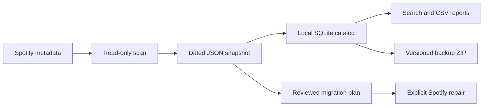

# Personal Music Library

A local catalog for your Spotify playlists, Liked Songs, and local-track references. This project began as **Spotify Shadow Track Migration**; that repair tool is now one part of the bigger music-library project.

GitHub: [personal-music-library](https://github.com/mrdc1790/personal-music-library). Renamed September 17, 2026. The existing local folder is still named `spotify-shadow-track-migration`; your launchers and paths continue to work there.

**The immediate benefit:** answer “where is this song saved?”, find overlap between playlists, keep historical copies, and export your collection into readable files. You do not need to build a streaming service or install a music server to use these features.

## Start here — one small step

Double-click **`Try offline demo.cmd`** in this folder.

It uses made-up music, needs no Spotify login, and shows:

```text
Chill AND Festival: Moonrise
Chill NOT Festival: Harbor
Snapshot change: removed one duplicate Moonrise from Chill.
```

It also creates a database, CSV examples, a ZIP backup, and a restored database. The console prints their folder. Every run gets a new folder, so you can try it without overwriting anything.

If you prefer a terminal:

```powershell
python library_demo.py
```

**You can stop there.** The rest of this README is a reference, not a list of tasks you must complete today.

## View the database without learning SQL

Double-click **`View music catalog.cmd`**. It opens a searchable, read-only view in your browser. It uses `data/catalog.sqlite` if present; otherwise it opens your most recent offline demo catalog.

Use **Saved snapshot** to choose a scan, **Playlist** to browse a list, or search a song with all playlists selected to see everywhere it appears. Each row is one placement, so repeated rows may be intentional duplicates. Positions in this viewer start at 1. Synthetic examples are prominently labeled.

The viewer creates `catalog-view.html` beside the database. Reopen the launcher after importing new data to refresh that saved view. No server, SQL knowledge, installation, upload, or Spotify login is needed. The viewer contains the catalog metadata; keep it private like your CSVs. Large catalogs/history may take longer to generate and open because the saved view includes all snapshots.

To choose a specific database:

```powershell
python view_catalog.py 'backups/YOUR_DEMO_FOLDER/catalog.sqlite'
```

## What works, and what does not yet

| Capability | Status | Meaning |
|---|---|---|
| Offline demo | Working; tested | Try the workflow with synthetic examples |
| Browser catalog viewer | Working; read-only | Browse snapshots, filter playlists and search songs |
| Historical local database | Working; tested | Import multiple audit snapshots without overwriting earlier scans |
| Song → playlists search | Working; tested | Search title, artist text, or Spotify ID; see each occurrence |
| Union / intersection / difference | Working; tested | Compare observed identities in successfully exported playlists |
| CSV exports | Working; tested | Per-playlist files, reverse memberships, artist summaries, duplicates |
| Compare two scans | Working; tested | Detect occurrence-count/order/name changes; flag unknown coverage |
| Backup and restore | Working; tested locally | Create a consistent database ZIP and restore to a new file |
| Spotify read-only scan | Implemented; needs live account validation | Requires your Developer app and browser consent |
| Shadow-track migration | Implemented; offline tests only; restricted | Requires reviewed mappings, suitable identity evidence, and explicit execution |
| Local audio-file scanning/matching | Planned | Local playlist references are saved; your actual music folders are not scanned |
| Artist follows/unfollows and genre enrichment | Planned | Different from the artist playlist counts already exported |
| Nested folder capture | Planned | This version does not import or reconstruct Spotify folders |
| Same recording across different releases | Planned | Current queries do not automatically merge different Spotify IDs |
| Visual smart-playlist recipes | Planned | Smarter Playlists-inspired sources, rules, and result previews; current set queries provide part of the foundation |
| Symfonium/M3U/Navidrome integration | Planned | No player, server, or audio transfer has been installed |
| Online uploads / scheduled backups | Not configured | ZIP creation works; no cloud uploader or schedule was enabled |

**No real Spotify account scan or migration has been performed in this workspace.** Passing tests means the code works against known examples and a simulated API. It does not establish compatibility with your live account.

## The three parts, in plain English

1. **Scan:** ask Spotify for the metadata it permits us to read. Save a dated snapshot.
2. **Catalog:** import those snapshots into one local database. Search, compare, and export without contacting Spotify again.
3. **Repair:** separately review proposed Spotify changes. This is advanced work and has stricter requirements.



The metadata catalog is not a backup of the audio. A local-track reference can survive even after its MP3 is gone.

## How the conversations fit together

I read the two links you sent and, after your approval, all five additional chats linked inside the export conversation. Their shared direction is one personal music library with several capabilities:

- **Shadow releases:** keep old/new identities and every playlist occurrence; propose repairs.
- **All Leaks:** preserve local-track references and later compare them with files you actually have.
- **Playlist limits:** keep larger collections locally; eventually generate smaller service-specific playlists.
- **Artist tracker:** observe follows over time and keep genre evidence and manual choices.
- **Music hub:** eventually add a usable interface, providers, sharing, DJ features, and playback where supported.

The tracker conversation is **not redundant**: it contains follow-history and genre requirements. The two shadow-track conversations largely repeat the same core exchange. No chats were deleted or reorganized.

Read [the master project brief](docs/MASTER_PLAN.md) for the full consolidation and links. [The examples guide](docs/EXAMPLES.md) shows concrete questions and answers.

## Requirements and opening a terminal

- Windows with Python 3.11 or newer; this workspace was tested with Python 3.13.
- No Python package installation is needed for the current commands.
- For the real scan only: a Spotify Developer app and appropriate account access.

Open PowerShell in this project folder. If necessary:

```powershell
Set-Location '%USERPROFILE%\OneDrive\Documents\ChatGPT\spotify-shadow-track-migration'
python --version
```

Commands below assume this working directory. Replace labels such as `YOUR_CLIENT_ID` and `YOUR_SCAN` with actual values. Do not type angle brackets around them.

## First real scan — when you are ready

1. Open the [Spotify Developer Dashboard](https://developer.spotify.com/dashboard) and select your app.
2. Configure its redirect URI to exactly `http://127.0.0.1:8765/callback`.
3. Copy the **Client ID**. This project does not need the Client Secret.
4. Run:

```powershell
python migrate.py scan --client-id YOUR_CLIENT_ID
```

5. Complete Spotify login and read-only consent in the browser.
6. Open the printed `report.html` and check coverage/errors before relying on the results.

The scan creates `backups/<dated-folder>/snapshot.json`, `report.html`, `library.sqlite`, and audit proposals. Private/collaborative scopes are requested; tokens remain in memory. Keep playlist edits paused during scanning.

The default app mode is Development Mode. Do not choose Extended Mode to bypass a blocker: the flag only records a capability the app must already possess. Development Mode can still supply useful read-only catalog data, but hidden original track IDs prevent reliable automatic shadow repair. See the [official migration guide](https://developer.spotify.com/documentation/web-api/tutorials/february-2026-migration-guide).

The original **`Start audit.cmd`** remains an alternative read-only launcher.

## Import that scan into your catalog

```powershell
python library.py import 'backups/YOUR_SCAN/snapshot.json' --label 'First real scan'
python library.py snapshots
python library.py playlists
```

This creates `data/catalog.sqlite`. Do not confuse it with the `library.sqlite` inside an individual scan:

| File | Purpose |
|---|---|
| `backups/<scan>/snapshot.json` | Original metadata returned for one scan |
| `backups/<scan>/library.sqlite` | The original audit's database for that one scan |
| `data/catalog.sqlite` | New working catalog containing multiple historical scans |

Importing the exact same snapshot twice returns the existing snapshot ID. A different account must use a separate catalog. The demo deliberately uses a separate database.

## Ask questions of your library

```powershell
python library.py find '2 Busy'
python library.py find '623tFk37Yd1PBpo926WiLu'
python library.py query intersection PLAYLIST_A_ID PLAYLIST_B_ID
python library.py query union PLAYLIST_A_ID PLAYLIST_B_ID
python library.py query difference PLAYLIST_A_ID PLAYLIST_B_ID
```

Use IDs shown by `playlists`, not playlist names. `liked` is the special ID for Liked Songs. Search is a case-insensitive text search; it is not fuzzy recording matching.

- **Union:** songs in A or B, once per observed identity.
- **Intersection:** songs in both A and B.
- **Difference:** songs in A but not B. With A B C, exclude anything in B or C.
- **Occurrence:** one placement. The same song twice in one playlist has two occurrences.

Search preserves every placement. Set operations return distinct identities. Neither operation changes Spotify. Unidentified items are excluded from set operations. If a requested playlist was not successfully exported, the query stops rather than pretending it was empty.

The default is the **most recently imported** snapshot, not necessarily the newest scan date. Add `--snapshot 1` to select a particular snapshot. See `snapshots` to choose correctly.

## Export files you can inspect

```powershell
python library.py export exports/first-export
```

The destination must be new. It contains:

| Output | What it answers |
|---|---|
| `playlists.csv` | What sources were captured, and were their contents readable? |
| `playlist_items.csv` | Every placement, in order, including duplicates and local references |
| `tracks.csv` | One representative metadata row per observed identity |
| `song_playlist_membership.csv` | Which song belongs to which playlist, and how many times? |
| `songs_with_playlists.csv` | A readable list of all source names for each song |
| `artist_playlist_summary.csv` | Artist credits, distinct observed tracks, and placement counts by source |
| `duplicate_occurrences.csv` | Repeated observed identities inside a source |
| `playlists/*.csv` | One CSV per playlist/Liked Songs; filenames are mapped in the manifest |
| `manifest.json` | Snapshot, source coverage, filenames, and interpretation notes |

CSV files use UTF-8, with a byte-order marker for Excel. Positions start at zero. Lists such as artists and playlist names are JSON arrays inside CSV cells. Blank metadata means unknown, not zero. Text that could be interpreted as a spreadsheet formula is prefixed with an apostrophe; exact source text stays in the database.

Artist names from local files are grouped as **unmatched names**, not silently equated to Spotify artist IDs. “All credits” includes featured artists; “primary” counts only the first artist credit. These counts do not indicate whom you follow.

CSV **import from arbitrary services is not implemented**. The supported input is this project's `snapshot.json` format. Raw source metadata remains in the database for fields not exposed as CSV columns.

## Track changes and make a backup

After a later scan, import its snapshot and compare the displayed IDs:

```powershell
python library.py import 'backups/LATER_SCAN/snapshot.json' --label 'Later scan'
python library.py compare 1 2
python library.py backup backups/catalog-2026-09-16.zip
```

The comparison counts duplicate additions/removals, notices sequence changes and renamed playlists, and marks unread/newly absent sources as coverage changes. It does not infer that a song was deleted when a playlist could not be read. Changes in an API-returned identity may reflect relinking, not an edit you made. Metadata-only changes such as a title correction are retained in snapshots but are not yet separately diffed.

To test restoration into a new file:

```powershell
python library.py restore backups/catalog-2026-09-16.zip data/restored-catalog.sqlite
python library.py --db data/restored-catalog.sqlite snapshots
```

The backup contains a consistent database copy plus a SHA-256 checksum. Restore validates the checksum and database and refuses to overwrite an existing file. Keep the original audit folders and migration journals too: the catalog ZIP does not include separate repair journals.

### What about backing it up online?

The project is already in your OneDrive Documents folder, but I have not verified your OneDrive sync status or configured an upload. Use versioned ZIP snapshots as the portable copy; do not depend on synchronizing a database while it is being edited. A cloud copy of a ZIP is enough for the first stage—no hosted database is needed.

Read [backup and restore guidance](docs/BACKUPS.md). The current ZIP is unencrypted and contains music metadata, not audio. Your actual music files need their own backup.

## Shadow migration is an advanced, separate workflow

Read [the migration guide](docs/MIGRATION.md) before using `migrate.py plan/apply/resume/rollback`.

No catalog query triggers a migration. Migration remains blocked without sufficient identity evidence. A manually approved mapping is not proof that an old/new pair is correct. Rollback is not lossless: rebuilding affected playlists can reset dates/attribution and unavailable originals may not be re-addable. Near-full playlists may reject temporary insertions; capacity-aware repair is not implemented.

## Troubleshooting

| What you see | Meaning / next step |
|---|---|
| `python` not recognized | Python is not available in that terminal; try `py --version` and use `py` consistently if available |
| Unable to open database | Import a snapshot first, or check `--db`; read commands never silently create an empty database |
| Snapshot not found | Run `snapshots` and choose a listed ID |
| Playlist not exported | Inspect scan errors; unknown coverage is not an empty playlist |
| Another database | Use `data/catalog.sqlite`, not the per-scan `library.sqlite` |
| Separate catalog for a different account | Keep synthetic demos and real accounts in different databases |
| Output already exists | Use a new export/backup/restore filename to retain history |
| Development Mode migration blocker | Catalog features can still work; automatic repair cannot safely infer hidden original IDs |
| Local track found in export but unavailable on phone | The reference is present; this does not establish where its audio exists or phone playback state |
| Spotify login/rate-limit/access failure | Preserve partial exports, inspect the report, and resolve access before treating a scan as complete |
| Spotify HTTP 500/502/503/504 | Read requests now retry up to four times with short waits. If still failing, retry the audit later. This is not evidence of an empty library or a bad Client ID |
| Many retries returning to 2 seconds | Each page has its own retry budget. A reset usually means the previous read succeeded. New runs display received-entry counts, elapsed time, the failing page offset, and recovery messages. many likes require about many successful paginated reads. Updating the script does not update an already running process; do not restart a progressing scan just for the new messages. |
| MemoryError during audit | Updated September 19: completed sources are stored in SQLite, and final JSON/HTML are streamed to disk. Restart `Start audit.cmd` to use the fix. A fresh run creates a new folder; automatic resume is not implemented. Prior completed SQLite checkpoints remain available. |

## Files and more detail

- `audit.py`: original read-only Spotify audit.
- `migrate.py`: guarded migration workflow.
- `library.py`: offline historical catalog, queries, CSV export, backup and restore.
- `library_demo.py`: reproducible synthetic example.
- `view_catalog.py`: searchable saved HTML view of your local catalog.
- `demo.py`: earlier synthetic migration-plan example.
- `mappings.example.json`: unapproved example replacement mapping.
- [Examples](docs/EXAMPLES.md): exact sample data, commands and expected results.
- [Master plan](docs/MASTER_PLAN.md): all conversation requirements and priorities.
- [Smart playlist design](docs/SMART_PLAYLISTS.md): Smarter Playlists inspiration, an example, and what is still planned.
- [What you can do today](docs/CURRENT_CAPABILITIES.md): browsing, duplicates, relinking, local audio, Symfonium, and the 10k limit.
- [Data dictionary](docs/DATA_MODEL.md): identity, timestamps, tables, and limits.
- [Backups](docs/BACKUPS.md): metadata versus audio, local versus online copies, recovery.
- [Migration](docs/MIGRATION.md): advanced write operations and restrictions.

## Validation

```powershell
python -m unittest -v
```

40 tests passed on September 19, 2026. Coverage includes snapshot history, incomplete exports, duplicate set semantics, CSV formula escaping, backup/restore integrity, bounded server-error retries, disk-backed audit exports, failed-source rollback, and the previous migration tests. A synthetic export larger than 24 MB stays below 8 MB of traced Python memory. The offline walkthrough also successfully restored its backup. The September 18 live audit saved [private count] placements across many exported playlists before the reported memory failure; its checkpoint remains incomplete. The new audit memory fix still needs a complete live run. Catalog import, viewer performance at that scale, live repair, phone playback, and cloud uploads remain unvalidated.
