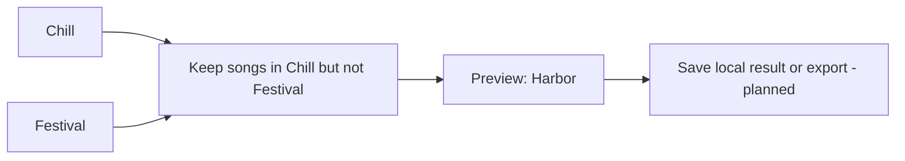

# Smart playlists: design direction

Status: **planned interface, not implemented**. The current catalog already supports local union, intersection, and difference queries. It does not have a visual recipe editor, saved recipes, a scheduler, or a general Spotify playlist publisher.

## The idea in everyday terms

The database remembers your music. A recipe tells it which songs to select. The interface should let you connect a few understandable boxes and see the answer immediately.

For example: **take songs in Chill, remove anything also in Festival, and show what remains**. In our synthetic demo the answer is **Harbor**. This selection does not remove anything from either source playlist.

The current command for that question is a `library.py query difference` using the two playlist IDs. See [the runnable examples](EXAMPLES.md). The diagram is a proposed interface for that operation, not a screenshot of a working editor.

## Inspiration and evidence

The user supplied [Smarter Playlists](https://smarterplaylists.playlistmachinery.com/#editor) and said they like how it works. Its public page, inspected September 17, 2026, describes a visual component editor, mixing/filtering/sorting, multiple track sources, and scheduled programs. The editor requires login; no Spotify authorization was granted and no program was run during this review.

We are adopting the idea of visible, connected steps as a design preference. This is not a Smarter Playlists integration, program importer, or promise to reproduce every component. Availability of genre, audio-feature, recommendation, or other enrichment data must be established separately for our sources and account access.

## Proposed first version

1. **Choose a saved snapshot.** Display its scan date and source coverage. All source boxes in a run use that same snapshot.
2. **Choose playlists or Liked Songs.** Show friendly names and stable IDs; duplicate names remain distinguishable.
3. **Connect rules.** Start with “in either,” “in both,” and “in A but not B.” Offer simple form controls as well as a future graph view.
4. **Preview.** Show the resulting songs, count, and why each song was included. Let the user inspect intermediate steps.
5. **Save a recipe or result.** A recipe remembers the rules; a saved result remembers the songs from one run. Make this distinction visible.

The first useful deliverable should work on the existing synthetic catalog without login. Later add sorting, limiting, seeded shuffle, artist spacing, and optional deduplication as explicit steps with visible effects.

## Rules that keep results understandable

- Preserve original playlist occurrences and ordering in the catalog. Recipe results are derived views.
- Label set operations as returning one entry per observed identity. Do not silently merge different releases of the same recording.
- Show excluded unidentified entries and incomplete source coverage. Missing data is not an empty playlist.
- Store snapshot ID, recipe version, parameters, and any shuffle seed with a run so its result can be explained and reproduced.
- Define output ordering explicitly before offering playlist export; mathematical sets alone do not define a listening order.
- Keep local-file references visible without claiming the audio is available or playable.
- Show unavailable filter fields as unavailable. Do not interpret missing genre, BPM, or energy as zero or a negative match.

## Later capabilities

| Capability | Proposed behavior |
|---|---|
| Refresh a recipe | Explicitly choose a newer snapshot and preview the changes |
| Scheduled runs | Explain whether they use saved data or obtain a new scan; preserve run history |
| Publish to Spotify | Separate destination selection and change preview, with live capability checks |
| Very large results | Keep the full local collection; review any split into service playlists |
| Online backup | Include recipe definitions and run records in versioned backups once implemented |
| Smarter Playlists import | Investigate its actual export format before promising compatibility |

## Acceptance examples for future implementation

With the existing synthetic snapshots, the visual rules should return Moonrise for Chill AND Festival and Harbor for Chill NOT Festival. A run must not change the source snapshots. Selecting an unread source must explain the missing coverage. Saving and reopening a recipe must preserve its rules, and rerunning it against the same snapshot must reproduce the same ordered result.

These are future acceptance criteria, not additional tests claimed to pass today.
