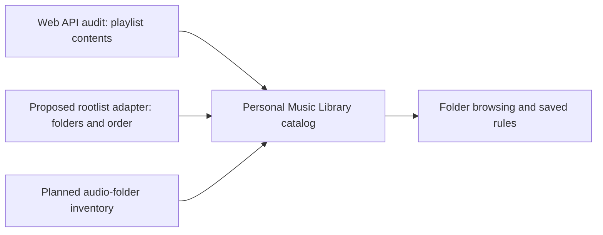

# Spotifast / librespot as a second Spotify adapter

Investigated September 23, 2026. Status: **documented candidate, not integrated or live-tested with this account**.

## What our scanner currently misses

The audit reads playlists and items through Spotify's Web API. A playlist being inside a folder does not itself make it unreadable, but only playlists returned and accessible to the account are captured. The result is flat: folder nodes, nesting, empty folders, and their ordering are not recorded. Order of songs inside each exported playlist is preserved. API playlist-list order must not be presented as the desktop folder hierarchy.

Spotify explicitly documents that its Web API does not return or create folders: [playlist documentation](https://developer.spotify.com/documentation/web-api/concepts/playlists).

## Evidence for another read path

[Spotifast's own capability documentation](https://spotifast.rocks/what-spotify-allows/) says it reads playlist folders/order from the account rootlist over a librespot session. It documents folder reading, not creating, renaming, or moving Spotify folders. It also documents session-based reads for some playlist contents. This is useful evidence of feasibility, not proof that our adapter is implemented or that this user's installed version exposes an export.

[Its connection documentation](https://spotifast.rocks/how-it-connects/) ties rootlist reads to an authenticated local playback session and describes account-scoped handling. [Cargo.toml](https://github.com/crmne/spotifast/blob/main/Cargo.toml) identifies a librespot fork and playlist4 protobuf parsing. A folder reader will need a deliberate integration; installing a generic library does not automatically add this to our Python catalog. The source review below checks the actual reader and parser; no live account export was attempted.

## Source verification

Reviewed Spotifast commit `f6ce05b1dd1a9c97cdd1e93999e90f441fec54da` on September 23, 2026:

- [src/player.rs](https://github.com/crmne/spotifast/blob/f6ce05b1dd1a9c97cdd1e93999e90f441fec54da/src/player.rs): `Engine::rootlist` calls `session.spclient().get_rootlist(from, Some(500))`, decodes playlist4 `SelectedListContent`, and collects pages before parsing structure. `RootlistEntry` represents playlist URIs, folder starts with IDs/names, and folder ends. `parse_rootlist` recognizes `spotify:start-group:` and `spotify:end-group:` markers and decodes folder names. This is concrete evidence for a read adapter.
- The parser is suitable for display but should not be copied unchanged for archival evidence: it ignores unmatched closing markers, discards unsupported URI types, and synthesizes closes for unfinished folders. Our importer should retain raw ordered rows and flag malformed/incomplete structure separately from any repaired display tree.
- [examples/rootlist_probe.rs](https://github.com/crmne/spotifast/blob/f6ce05b1dd1a9c97cdd1e93999e90f441fec54da/examples/rootlist_probe.rs) is an existing diagnostic example, not a ready catalog export. It uses stored Spotifast playback credentials and prints permission metadata. We inspected its source only; did not execute it or access credentials.

The linked September 23 ChatGPT conversation was read in full. Its useful direction is to make captured data visible (playlist overlap and Saved In browsing), inventory actual audio files, and eventually introduce reviewed recording identities. Rootlist capture complements those steps. Claims that it will recover original relinked IDs remain hypotheses requiring sample evidence.

## Proposed architecture

Keep the existing catalog, historical snapshots, raw data, source identities, backups, and resumable Web API scanner. Add an optional adapter that supplies structure alongside those records:

The adapters must record their account, source, capture time, version/revision when available, and coverage independently. Join playlists by Spotify ID/URI, not name. If the rootlist includes a playlist whose contents were unreadable, display its position in the tree with contents marked unknown. Do not delete it or pretend it is empty. Different capture times are not an atomic whole-library snapshot.

## Bounded first proof of concept

1. Inspect the actual Spotifast rootlist code and pinned dependency revision. Determine whether a supported metadata-only export exists; otherwise prototype a small separate read-only exporter using the applicable library interfaces. Review dependency licensing before reusing code.
2. Obtain a user-authorized rootlist read. Do not extract Spotifast credential stores or assume that Web API OAuth grants a librespot session.
3. Save a versioned structure export with stable folder IDs where supplied, parent relationships, sibling order, playlist references, raw evidence, and incomplete/unknown state. Preserve duplicate folder names and empty folders. Do not infer hierarchy from names.
4. Validate several known nested branches against Spotify/Spotifast, including an empty folder, repeated names, and a playlist with unreadable contents.
5. Import into a separate catalog structure snapshot. Join by playlist ID and display the tree alongside existing song-to-playlist lookup. No Spotify writes are part of this proof of concept.

Success means accurately reconstructing the validated folder tree without losing the existing audit history. Rootlist fetching alone is not the finished feature.

## Boundaries

- This could improve folder visibility and provide independent evidence for selected playlist discrepancies. It does not establish that the Liked Songs discrepancy will be resolved; Spotifast also uses the Web API for saved tracks.
- Different access paths have different field coverage. Keep unavailable/unknown states explicit and do not assume session data contains hidden original IDs.
- Do not promise unlimited requests, a rate-limit bypass, or removal of Spotify's 10k playlist limit.
- Local Spotify references still need a separate filesystem inventory and matching workflow. Spotifast documents that librespot cannot fetch audio for spotify:local entries; rootlist support does not prove file availability on any device.
- Folder capture would be valuable to the central hub and smart-collection UI. BPM/key analysis, recording identity matching, DJ export, and owned-audio playback remain separate capabilities.

No account was connected to a new service, software installed, credentials read, or running scan modified during this investigation.
